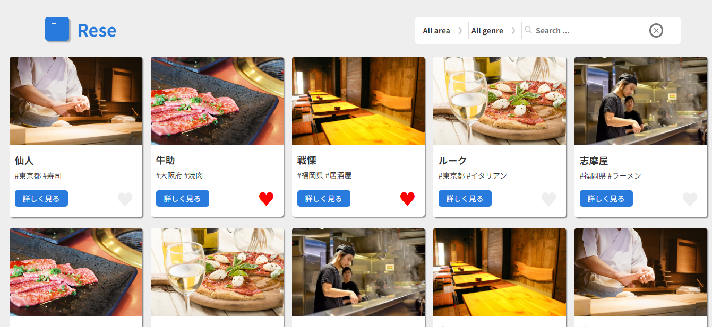
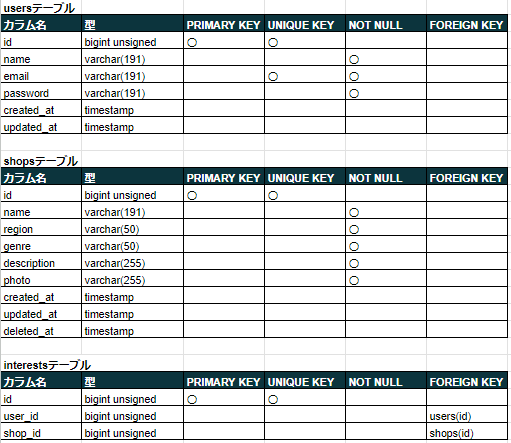
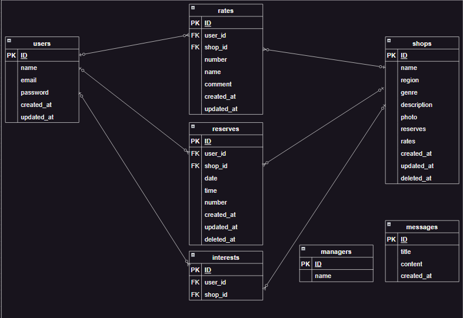
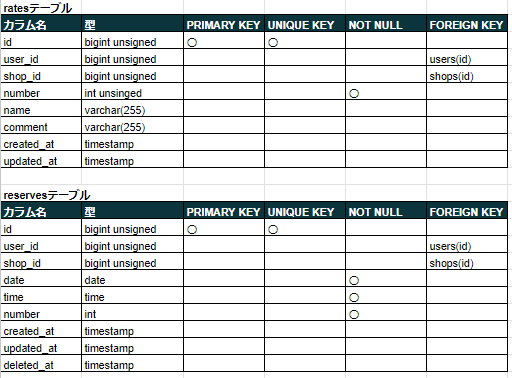
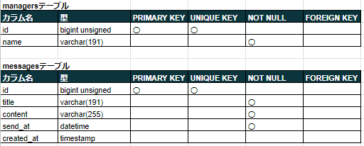
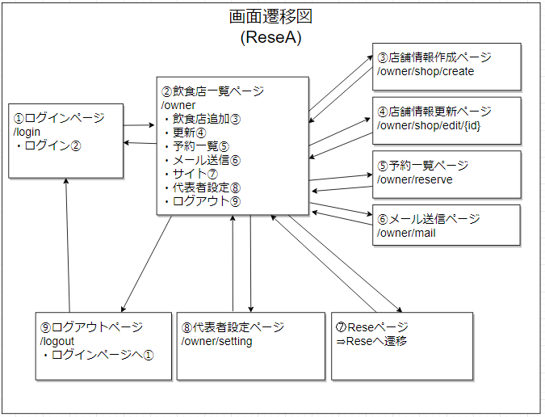
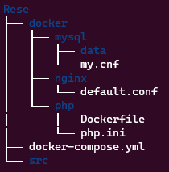

## アプリケーション情報

■ アプリケーション名<br />
・Rese

■ 概要<br />
・飲食店の予約を行うサイト<br />

■ トップ画像


## 作成した目的

・仮飲食店の予約を管理するため

## アプリケーション URL

ローカル環境で作成しています。<br />
[アプリ]<br />
&emsp;localhost/<br />
[phpMyAdmin]<br />
&emsp;localhost:8080<br />
[MailHog]<br />
&emsp;localhost:8025<br />

## 機能一覧

・会員登録<br />
・ログイン<br />
・ログアウト<br />
・メール認証<br />
・ユーザー情報取得<br />
・ユーザー飲食店お気に入り一覧取得<br />
・ユーザー飲食店予約情報取得<br />
・飲食店一覧取得<br />
・飲食店詳細取得<br />
・飲食店お気に入り追加<br />
・飲食店お気に入り削除<br />
・飲食店予約情報追加<br />
・飲食店予約情報変更<br />
・飲食店予約情報削除<br />
・エリアで検索する<br />
・ジャンルで検索する<br />
・店名で検索する<br />
・Stripe 決済<br />
・飲食店評価の追加、編集<br />
・お知らせメール送信<br />

## 使用技術(実行環境)

■ 使用言語<br />
・HTML<br />
・CSS<br />
・JavaScript<br />
・PHP 8.2.7

■ 使用フレームワーク<br />
・Laravel Framework 8.83.27

■ 使用認証方法<br />
未使用

■ メール認証<br />
・MailHog

## テーブル設計



## ER 図





## 画面遷移図




## 環境構築

■ 開発環境<br />
・土台<br />
&emsp;Docker<br />
&emsp;LinuxOS<br />
・操作<br />
&emsp;ubuntu<br />
&emsp;VSCode<br />
・サーバー<br />
&emsp;nginx<br />
・データベース<br />
&emsp;mysql<br />
&emsp;phpMyAdmin<br />
・管理<br />
&emsp;Git<br />
&emsp;GitHub

■ 環境構築方法<br />
(1)下記ディレクトリ構成で、ディレクトリを作成<br />
<br />
(2)コンポーザーインストール<br />

```bash
$ RUN curl -sS https://getcomposer.org/installer | php \<br />
```

(3)Laravel インストール<br />

```bash
$ docker-compose exec php bash
$ composer create-project "laravel/laravel=8.*" . --prefer-dist
```

(4)Mysql コンテナ上で、データベース(laravel_db)作成<br />

```php
$ docker-compose exec mysql bash
```

(5)作成途中に PC 不具合が起き、作成途中の Github 情報を clone して、作成を行いました。そのため、プルリクエスト情報が一部のみになっています。
[作成過程１]
https://github.com/pcspread/Rese_save1
[作成過程２]
https://github.com/pcspread/Rese_save2

## その他

■ ダミーデータ<br />
下記の内容で、seeder ファイルを登録しています。<br />
[内容]<br />
・ユーザー情報　　　：一般ユーザー 3 人、店舗代表者、管理者<br />
・代表者名　　　　　：topp1111<br />
・飲食店情報　　　　：20 件　　<br />
・飲食店評価コメント<br />
★ 下記(1)(2)の順で作成をお願いします<br />
(1)php artisan migrate<br />
(2)php artisan db:seed

■ ログイン用ダミーデータ<br />
[一般ユーザー]<br />
・メールアドレス：test1@test.com～test3@test.com<br />
・パスワード　　：test1111(共通)<br />
[店舗代表者]<br />
・メールアドレス：topp1111@top.com<br />
・パスワード　　：topp2222<br />
[管理者]<br />
・メールアドレス：owner1111@owner.com<br />
・パスワード　　：owner2222<br />

■ メール認証<br />
新規登録時には、メール認証を行っています。<br />
ローカル環境の為、MailHog を使用しています。<br />
[管理画面]
http://localhost:8025<br />
